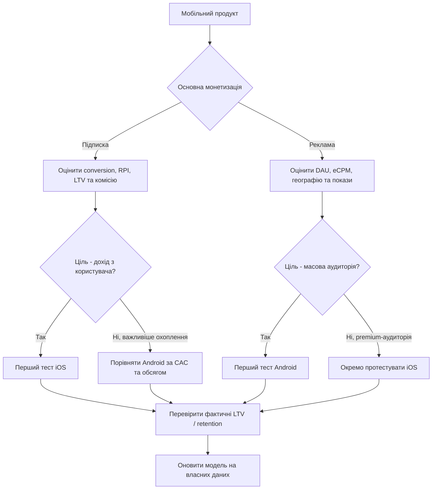

##Варіант 4: Економіка платформ 

### 1. Мета аналізу

Порівняти Android та iOS з погляду монетизації мобільного продукту та визначити, за яких умов доцільно починати запуск з однієї платформи, а за яких - з іншої. Розглянуто два різні способи монетизації: підписку та рекламу.

Дата звірення даних: **20.09.2026**. Для ринкової частки використано останні доступні повні місячні дані за **серпень 2026**, для монетизаційних бенчмарків - звіти 2025-2026 років.


### 2. Вихідні дані

| Показник | Android | iOS | Джерело / дата |
|---|---:|---:|---|
| Світова частка мобільної ОС | 67,61% | 32,36% | StatCounter, серпень 2026 |
| D60 RPI для subscription apps | $0,16 | $0,42 | RevenueCat, 2026 |
| D35 download-to-paid, медіана | 0,9% | 2,6% | RevenueCat, 2026 |
| Y1 RLTV на платника, медіана | $21,62 | $23,38 | RevenueCat, 2026 |
| Реєстрація акаунта розробника | $25 одноразово | $99/рік | Google / Apple |
| Вимога для iOS-збірки | macOS + Xcode | macOS + Xcode | Apple |
| Комісія за підписки в ЕЕА | 10% + 5% billing fee = 15% для Google Play Billing | 15% для кваліфікованих підписок / програм; стандартні умови можуть відрізнятися | Google / Apple |

> **Важливо:** RPI та RLTV у RevenueCat є бенчмарками для subscription apps, а не гарантованим доходом нового продукту. Фактичний результат залежить від категорії, країни, ціни, конверсії та retention.

### Частка ринку

За StatCounter, у серпні 2026 року Android мав **67,61%** світового мобільного трафіку за операційною системою, iOS - **32,36%**. Отже, Android має більшу потенційну базу для масового охоплення, але сама частка ринку не показує дохідність одного користувача.

Джерело: [StatCounter - Mobile Operating System Market Share Worldwide](https://gs.statcounter.com/os-market-share/mobile), дані за серпень 2026.

### Дохід на користувача та конверсія

RevenueCat у звіті State of Subscription Apps 2026 наводить для D60 median RPI **$0,42 для App Store проти $0,16 для Google Play**. У тому ж наборі даних медіанна конверсія з інсталяції в платну підписку до D35 становить **2,6% на iOS проти 0,9% на Android**. Для Y1 RLTV різниця значно менша: **$23,38 проти $21,62** на платника.

Джерело: [RevenueCat - State of Subscription Apps 2026](https://www.revenuecat.com/state-of-subscription-apps), звіт 2026.


## 3. Комісії магазинів

Комісія залежить від типу платежу, регіону та програми розробника, тому в розрахунку потрібно явно вказувати сценарій.

Для Apple стандартна комісія за цифрові товари та послуги становить 30%, але для App Store Small Business Program та окремих кваліфікованих підписок застосовуються нижчі ставки, зокрема 15%. Для користувачів у ЄС також діють окремі умови Apple, тому перед фінальним запуском необхідно перевірити актуальний режим для конкретного платіжного сценарію.

Джерела: [Apple Developer - Pricing and fees](https://developer.apple.com/programs/whats-included/), [Apple - EU payment options](https://developer.apple.com/support/payment-options-on-the-app-store-in-the-eu/).

Для Google Play у ЄЕА з 30.06.2026 для автоматично поновлюваних підписок базова схема становить **10% service fee + 5% billing fee**, тобто 15% при використанні відповідного білінгу. Для інших цифрових транзакцій ставка залежить від типу інсталяції та програми.

Джерело: [Google Play - Service fees](https://support.google.com/googleplay/android-developer/answer/112622), правила чинні у 2026 році.


### 4. Модель 1 - підписка

### Розрахункова формула

Для спрощеного сценарію:

```text
Дохід після комісії =
Кількість встановлень × Конверсія в платну підписку × Ціна підписки × (1 - Комісія магазину)
```

### Ілюстративний сценарій

Припустимо:

```text
10 000 встановлень
Ціна підписки = $40
Комісія магазину = 15%
```

Тоді з використанням медіанної D35 конверсії RevenueCat:

| Показник | iOS | Android |
|---|---:|---:|
| Встановлення | 10 000 | 10 000 |
| D35 download-to-paid | 2,6% | 0,9% |
| Платні користувачі | 260 | 90 |
| Валовий дохід при $40 | $10 400 | $3 600 |
| Після 15% комісії | $8 840 | $3 060 |

Це **сценарний розрахунок**, а не прогноз. Ціна $40 є припущенням для однакового порівняння платформ.

### Умова, за якої iOS має економічний сенс

За однакової ціни, однакової вартості залучення та однакової комісії перевага iOS у цьому сценарії формується через вищу конверсію в платну підписку. RevenueCat також показує вищий D60 RPI для App Store. Тому модель з підпискою доцільно тестувати з iOS на першому етапі, коли продукт розрахований на платоспроможну аудиторію та ключова метрика - дохід з користувача, а не максимальна кількість встановлень.

Водночас довгостроковий розрив менший: Y1 RLTV у звіті RevenueCat становить $23,38 для App Store та $21,62 для Google Play. Тому після накопичення власних даних продукту рішення потрібно переглядати за фактичними conversion, retention і LTV.


### 5. Модель 2 - реклама

Для рекламної моделі логіка інша. Доходи залежать не від покупки цифрового товару, а від показів реклами:

```text
Дохід від реклами =
Кількість активних користувачів × Покази на користувача × eCPM / 1000
```

Для реклами важливі:

```text
DAU / MAU
кількість рекламних показів
eCPM
fill rate
retention
географія користувача
тип реклами
```

Appodeal у звіті за Q4 2024 на основі понад 100 000 застосунків та 70+ рекламних джерел зазначає, що iOS мав вищий eCPM за Android у всіх розглянутих форматах і місяцях, а розрив особливо помітний у Північній Америці та Європі. Водночас Android має значно більшу світову мобільну аудиторію, а в країнах, що розвиваються, його відносна рекламна економіка може бути конкурентнішою.

Джерело: [Appodeal - The Latest eCPM Report 2025](https://appodeal.com/wp-content/uploads/2025/03/Appodeal-The-Latest-eCPM-Report-2025.pdf), дані за жовтень-грудень 2024.

### Умова, за якої Android має економічний сенс

Якщо продукт безкоштовний, монетизація побудована переважно на рекламі, а ціль - **масове охоплення та велика кількість показів**, Android дає більшу потенційну базу користувачів завдяки частці 67,61% проти 32,36% у iOS.

Для продукту, який орієнтований переважно на США та Західну Європу, необхідно окремо перевіряти iOS через вищі рекламні eCPM у цих регіонах. Тобто для реклами ключовим фактором є не тільки ОС, а й географія аудиторії та рекламний формат.


### 6. Вартість розробки та macOS

### Android

Для публікації через Google Play потрібна реєстрація розробника з одноразовою оплатою **$25**. Android-розробку можна вести на Windows, Linux або macOS.

Джерело: [Google Play Console - registration fee](https://support.google.com/googleplay/android-developer/answer/14659200), актуально для повної дистрибуції.

### iOS

Для публікації в App Store потрібна участь у Apple Developer Program - **$99 на рік**. Для iOS-розробки та збірки використовується Xcode, а актуальні версії Xcode працюють на підтримуваних версіях macOS.

Джерела: [Apple Developer Program](https://developer.apple.com/programs/), [Xcode - system requirements](https://developer.apple.com/xcode/system-requirements/).

Станом на вересень 2026 року Apple оголосила Mac mini M6 у Німеччині від **1 049 €**, з постачанням з 22.09.2026. Тому для команди без Mac це можна враховувати як додаткову стартову інвестицію в iOS-розробку. Якщо Mac уже є, ця стаття витрат зникає.

Джерело: [Apple Deutschland - Mac mini M6](https://www.apple.com/de/newsroom/2026/08/apple-unveils-a-more-powerful-mac-mini-featuring-the-all-new-m6-and-m5-pro/), оголошення 2026 року.


### 7. Порівняльна модель

| Критерій | Android | iOS |
|---|---|---|
| Потенційне глобальне охоплення | Високе: 67,61% | Нижче: 32,36% |
| Монетизація підпискою | Нижчий D60 RPI у benchmark | Вищий D60 RPI у benchmark |
| D35 conversion | 0,9% median | 2,6% median |
| Довгостроковий Y1 RLTV | $21,62 | $23,38 |
| Рекламний eCPM | Нижчий у benchmark Appodeal | Вищий, особливо NA/Europe |
| Стартова дистрибуція | $25 одноразово | $99/рік |
| Вимога macOS | Ні | Так, для Xcode/iOS-збірки |
| Основна перевага в моделі | Масштаб аудиторії | Вища монетизація одного інсталу |
| Основний ризик | Менший дохід з одного користувача | Додаткові витрати на Apple-екосистему |


### 8. Логіка прийняття рішення




### 9. Рішення

**Для моделі з підпискою:** стартовий тест доцільно проводити на **iOS**, якщо продукт має достатньо високу цінність для платної аудиторії та головною метрикою є дохід на інсталяцію. Основні аргументи: вищий D60 RPI у benchmark RevenueCat ($0,42 проти $0,16), вища медіанна конверсія в paid до D35 (2,6% проти 0,9%), а також трохи вищий Y1 RLTV на платника ($23,38 проти $21,62).

**Для рекламної моделі:** для глобального безкоштовного продукту з акцентом на масштаб доцільно починати з **Android**, оскільки його частка світового мобільного ринку значно більша. Для США та Західної Європи iOS необхідно перевіряти окремо, оскільки Appodeal фіксує вищий eCPM iOS у цих регіонах.


### 10. Визнаний ризик

Головний ризик такого порівняння - **усереднення може приховати різницю між конкретними категоріями та країнами**. Дані RevenueCat описують subscription apps, а дані Appodeal - рекламну монетизацію з великої вибірки застосунків/ігор. Реальний продукт може мати іншу конверсію, retention, CAC та ARPU. Тому після MVP рішення потрібно оновлювати на основі власних cohort-даних, а не лише глобальних benchmark.


### 11. Висновок

Android має більшу глобальну аудиторію, тому його економіка сильніше пов'язана з масштабом і кількістю рекламних показів. iOS має меншу частку мобільної ОС, але в subscription-сценаріях наведені бенчмарки показують вищу ранню монетизацію на інсталяцію та вищу медіанну конверсію в paid.

Отже, для двох різних моделей отримуємо дві різні стратегії старту: **підписка - спочатку iOS; реклама - спочатку Android**, після чого рішення має підтверджуватися власними даними продукту.
